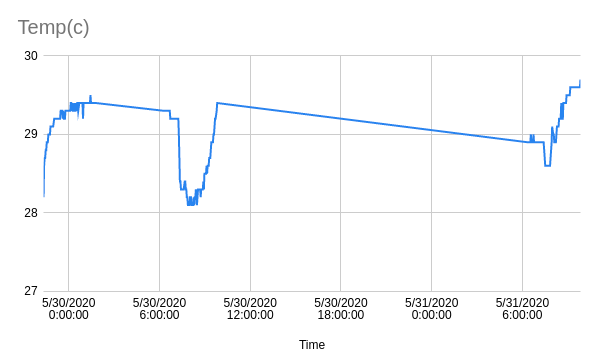

# Farm IoT with ESP8266
Collection of sensor data enables data-driven decision to support modern agriculture. 

In this project, we explore the following:
1. Environmental sensing
2. Control

## Current progress
- Codes to send DHT11 sensor data to Google Drive or to Blynk

## Built with
- ESP8266
- Arduino IDE
- Blynk
- Google Sheets code

## References
- https://examples.blynk.cc/?board=ESP8266&shield=ESP8266%20WiFi&example=More%2FDHT11
- https://www.hackster.io/detox/transmit-esp8266-data-to-google-sheets-8fc617

